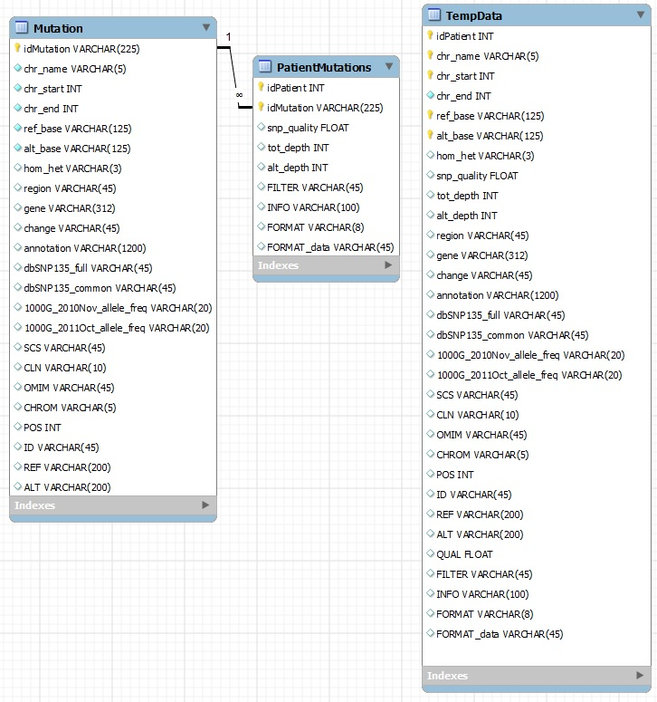

# Next-Gen Sequencing Esophageal Cancer Project, 2014

## Description
This was a Directed Study Project to find a way to analyze and predict possible cancer-causing genes in a population from Northeastern Iran which has a high incidence rate of esophageal squamous cell carcinoma using Next-Gen Sequencing data of cancer patients from that region.

## Fellows
This project was designed by **Dr. Ancha Baranova** for a group of 5-10 graduate students.  The final paper that resulted from an amalgamation of research, including our contribution, is available [online](https://journals.sagepub.com/doi/full/10.1177/1010428317699115) or uploaded here as a [PDF](NovelCandidateBaranova2017.pdf).  My group's particular contribution is much of the section on Data Analysis.

I will be presenting my personal contributions to that section, most of which involve the technical aspects of accessing and preparing the raw data for the pipeline.

## mySQL Database Setup
Database work was hosted on my personal desktop and run as a mySQL server that could be accessed remotely.

Initial Excel data was converted to a tab-separated CSV and inserted into a temporary table, in order to then be split into two different tables, linking data specific to certain mutations (name, start position, end position, reference base, and alternative base) to patients who have those particular mutations, connected by the foreign key idMutation.  The initial schema can be found [here](SQL/ngsesoph_schema_1.jpg).

However, at one point, we discovered we needed data in a VCF format (described [here](https://en.wikipedia.org/wiki/Variant_Call_Format)) in order to run some pipeline scripts, so I wrote a Python 2 script to concatenate the VCF columns onto the Excel CSV, [VCFConcat.py](VCFConcat.py).  Having a new, larger CSV file, I had to adjust the schema to accomodate the additional data, which could then be pulled as needed to create VCF data for only the genes that match a given query.

### Final Schema, including VCF data:

## Other Files
A number of sample SQL scripts - both table-building and queries - can be found in the [SQL](SQL) folder of this repository.  As well, to help my fellow biologists who have less coding expertise understand how to use the database, I put a sample query in a PDF file with specific explanations of each part of the query, so that they could build their own queries if they wanted to.  That SQL tutorial file can be found [here](SQL/SQLScriptingExample.pdf).

## Final Report
More information about my contribution to the project can be found in my final [Directed Study report](DirectedStudyReportEldridge.pdf) and [supplemental materials](DirectedStudyReportEldridgeSupMat.pdf).
